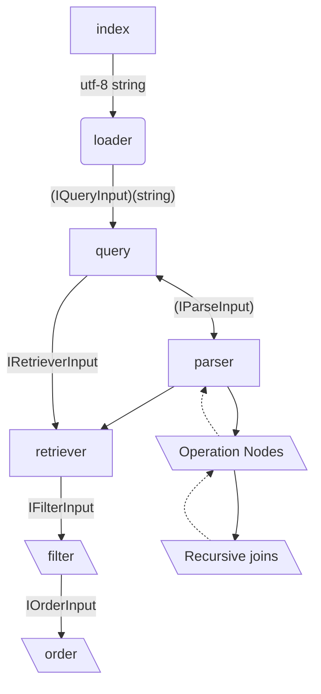

# A Prisma Query Language for @isaacs LRU-Cache

## Technical Decisions
---

When starting this project I wanted to first get a little bit of inspiration from open source projects. I referenced in particular open source packages, and here are the decisions I made

### **Diagram**
---



### **Language** - I chose to use TypeScript for this project.  I am not proficient in rust


## **Scope** Things I'm leaving at the front door but take into future considerations
---

1. **indexing** - I'm not going to worry about indexing at this point, but it's something that I'll need to consider in the future.
   1. **Recommendation** is to handle indexing by building a Trie structure(I'd recommend this [Trie](https://www.npmjs.com/package/trie-search)) package. This allows us to build a tree structure that relates back to an ID.  2. **caching** - I'm not going to worry about caching at this point, but it's something that I'll need to consider in the future.
   1. **Recommendation** is to handle caching by building a LRU cache structure(I'd recommend this [LRU-Cache](https://www.npmjs.com/package/lru-cache)) package.
2. **Security** - I'm not going to worry about security at this point, but it's something that I'll need to consider in the future. To me though a database is only as secure as its implementer. So I think this may be a userland feature that we can add in the future. Plain-text attacks are definitely a clear attack vector here though.
   1. **Recommendation** All security measures should be built with intentionality. Meaning that using 3rd party libraries like Lodash probably isn't a good move. My experience is that Lodash is typically one of the most sought after vulnerability hunts by hackers. So I'd recommend building your own security measures.
3. **Retrieval Optimization** - While it's super ugly, I wanted to focus on the core of this exercise, understanding and building query language. 

### Memory Loading Choice - PapaParse
---

Having used Papaparse in the past I have often found it to be pretty simple to manipulate, and use.  It also has two different modes of returning an array of objects, or an indexed array of arrays.

### Inspirations - Things I've used that I liked, and wanted to use for inspiration
---

- [SQL-92](https://en.wikipedia.org/wiki/SQL-92) - I wanted to use a SQL-92 standard for the query language, as it's the most widely used standard for SQL
- [knex](https://knexjs.org/) - a query builder that can be used for just about anything
- [prisma](https://www.prisma.io/) - c'mon ;o) you folks wrote the best there is on this
- [sequelize](https://sequelize.org/) - a promise-based Node.js ORM for Postgres, MySQL, MariaDB, SQLite and Microsoft SQL Server. It features solid transaction support, relations, read replication and more.

## About the Language
---

A lot of what I did here was breaking down how I thought about a query language and building a glossary of terms:

```sql
PROJECT col1, col2 FILTER col3 > "value"
```

1. Operations - `PROJECT`, `FILTER`
2. Columns - `col1`, `col2`, `col3`
3. Operators - `>`, `<`, `=`, `!=`,

Using this information I was able to generate a _very_ rough looping piece of code to start building a healthy pattern for orders of operations. This allows me to ensure that once we start moving towards recursion and more complex queries, we can ensure that we're following the correct order of operations.

## About the Loader
---

I want the loader to be part of my feature set to _plug in_ to our query language. There are some things I wanted to have to make error handling easier, and to give the users a head start on building.

## About the Process
---

So I wanted to keep things as stripped down as possible so I could design by types, and build implementations. I'm a bit of a fan of Kyle Simpson's [functional lite javascript](https://github.com/getify/Functional-Light-JS).

I started off really just getting a feel for the data, and what was coming in and coming out. While I've built atleast a hundred data parsers at this point in my life ensuring they were in proper ordinality was a bit of a challenge.

To solve this I built a feature I really enjoy in my favourite Query Builders, debuggers!

if you want to use it feel free to do `DEBUG=samql:<info | error | debug | query | etc..> npx nx serve prismapg` to access the different logs

I really wanted this application to fail often and fail fast, so by returning the header meta data I was able to

So here ultimately is the format I'd like this to look like:

```typescript
import samQl from 'samql';

const main = () => {
  const users = samQl.load('users.csv');
  const devices = samQl.load('devices.csv');

  const user = users.query('PROJECT name FILTER id > 1');
};
```

This allows for stronger extension later on and building the _escape hatch_ into the query language if we choose to build a query builder

### Process
---

I want to do the last amount of work possible before a failure to fail fast. Filtering/ordering and retrieval were probably going to be our most expensive commands, but retrieval was a requirement before the other 2 so it was unavoidable:

Each of these methods contains a different dependence inversion, but will always carry one core inversion. For this I used a bit of functional composition to keep my function arity at 1.

- `apps/prismapg/src/app/app.component.ts` - The main entry point for the application
- `libs/samql/src/lib/samql.ts` - The main entry point for the query language
- `libs/samql/src/lib/loader.ts` - The main entry point for the loading of files
- `libs/samql/src/lib/parser.ts` - The main entry point for the parsing of a query, this should not do any data fetching
- `libs/samql/src/lib/retriever-adapter.ts` - The main entry point for the execution of a query, this should do the data fetching

## Challenges I met along the way and the tradeoffs to facilitate
---

- [ ] TODO: **Checking Sorts vs. Projection/Select fields**
- [ ] TODO: **Allow direction of sorting** I forgot to do this, but parsing ASC/DESC would be a relatively easy fix
- [ ] TODO: **Facilitating JOIN & FROM** From ultimately ended up being an afterthought; however, it would be a relatively easy process to rectify by allowing a loader.  We could attach an array of loaded objects and toggle a flag to allow for joins.  For the time being, I feel allowing individual returns and userland combination is a good start.
- [ ] TODO: **retrieval typing** - I didn't take into consideration that every command would be a different adapter function, so I had to go read about all of the adapters.  I settled on a makeAdapter that allowed me to extend the initial sqlSections object with the adapters.  I can call this at the startup
- [x] **Time constraints** - I'll be honest I spent 6 hours on this project across two days.  I had a lot of fun, but I had to make some tradeoffs to get this done in time. Given more time I'd love to fully flesh out this solution.
- [x] **Knowledge Gap** - I should acknowledge this. I had never attempted a project like this before, as my background has always been a bit more on the web side. If I were to redo this project in 6 months I'd probably be able to do it in half the time.
- [x] **AST Refactor** - I had to refactor my AST a few times to get it to work properly.  The tradeoffs came primarily out of the loader.
- [x] **Parsing** - I had a lot of trouble with parsing, AND really threw me off for some reason
- [x] **Scope Creep** - Retrieval was really hard for me because I _really_ dislike not being able to refine the process.  My goals and my instincts were crashing here.  I decided to just focus on building a solid **_ADAPTABLE_** structure that I could refine later if needed.
- [x] - **Query Surface** I opte for a simple port surface exposed via express as this was not a primary goal of the project.  I wanted to focus on the query language itself.